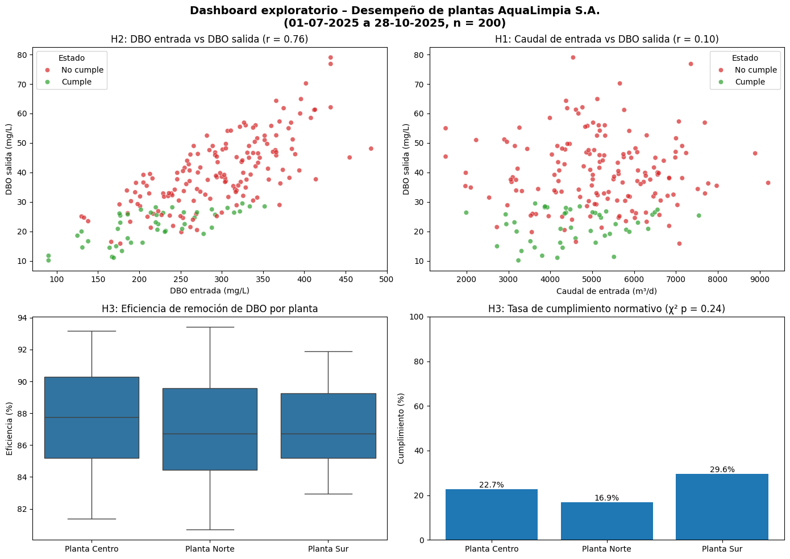

# Análisis de desempeño de plantas de tratamiento – AquaLimpia S. A.

[](https://colab.research.google.com/github/SimplyNameless/aqualimpia-analisis/blob/main/notebooks/analisis_aqualimpia.ipynb)

Proyecto de análisis exploratorio para identificar los factores asociados a los incumplimientos de DBO en el efluente tratado de las plantas de AquaLimpia S. A.

## Contexto

AquaLimpia S. A. trata aguas residuales urbanas e industriales en tres plantas. Durante el último periodo se detectaron incumplimientos en la demanda biológica de oxígeno (DBO) del efluente sin un patrón definido. El área de Operaciones planteó tres posibles causas: variaciones del caudal de entrada, cambios en la carga contaminante y diferencias operativas entre plantas.

## Objetivos

**General:** identificar qué factores se asocian a los incumplimientos de DBO para apoyar la priorización de acciones correctivas y respaldar los reportes de cumplimiento ambiental.

**Específicos:**
- Evaluar la relación entre el caudal de entrada y la DBO del efluente (H1).
- Evaluar la relación entre la carga contaminante de entrada y la DBO del efluente (H2).
- Comparar el desempeño y el cumplimiento normativo entre plantas (H3).
- Evaluar la calidad de los datos y sus efectos en las conclusiones.
- Generar reportes diferenciados para las áreas de Operaciones y Gestión Ambiental.

## Estructura del repositorio

```
aqualimpia-analisis/
├── data/               # Dataset original (no se modifica)
├── notebooks/          # Notebook del análisis
├── src/                # Funciones reutilizables
│   ├── procesamiento.py    # Carga, eficiencia y alertas (NumPy)
│   ├── analisis.py         # Correlaciones, intervalos y chi-cuadrado (SciPy)
│   ├── calidad.py          # Evaluación de calidad de datos
│   └── reportes.py         # Exportación de reportes y resultados (Joblib)
├── outputs/            # Reportes por área y resultados serializados
├── dashboard/          # Dashboard exploratorio (PNG)
├── requirements.txt    # Versiones de Python y librerías
└── README.md           # Este documento
```

## Datos

Archivo: `data/dataset_set_A_aguas_residuales.xlsx`. Contiene 200 registros de tres plantas (Centro, Norte y Sur), entre el 01-07-2025 y el 28-10-2025.

| Variable | Descripción | Unidad |
|---|---|---|
| `fecha_registro` | Fecha de la medición | – |
| `planta` | Planta de tratamiento | – |
| `caudal_entrada_m3_d` | Caudal de agua residual recibido | m³/d |
| `DBO_entrada_mg_L` | DBO del afluente | mg/L |
| `SST_entrada_mg_L` | Sólidos suspendidos totales del afluente | mg/L |
| `pH_entrada` | pH del afluente | – |
| `energia_aeracion_kWh` | Energía consumida en aireación | kWh |
| `lodos_generados_kg_d` | Lodos generados | kg/d |
| `DBO_salida_mg_L` | DBO del efluente tratado | mg/L |
| `cumplimiento_norma` | Cumplimiento normativo (1 = cumple, 0 = no cumple) | – |

Variable derivada: `eficiencia_remocion_pct = (DBO_entrada − DBO_salida) / DBO_entrada × 100`.

## Proceso

1. **Entorno:** clonado del repositorio, registro de versiones e importación de los módulos de `src/`.
2. **Carga y validación:** lectura del dataset con conversión explícita de la fecha.
3. **Transformación:** cálculo de la eficiencia de remoción.
4. **Calidad de datos:** completitud, unicidad, rangos válidos, atípicos, consistencia y cobertura temporal, con análisis de sensibilidad.
5. **Análisis:** correlación de Pearson con p-valor (H1 y H2), resumen por planta con intervalos de confianza y prueba chi-cuadrado (H3).
6. **Visualización:** dashboard con un panel por hipótesis.
7. **Exportación:** reportes por área y resultados serializados con Joblib.

## Cómo reproducir el análisis

1. Abrir el notebook con el botón **Open in Colab**.
2. Ejecutar **Entorno de ejecución → Ejecutar todas**.

El notebook clona este repositorio y genera los resultados en `outputs/` y `dashboard/`. Para trabajar fuera de Colab, instalar las dependencias con:

```bash
pip install -r requirements.txt
```

Para reutilizar los resultados sin ejecutar el análisis:

```python
from src.reportes import cargar_resultados
resultados = cargar_resultados()
```

## Resultados principales

| Hipótesis | Evidencia | Resultado |
|---|---|---|
| H1: Caudal de entrada | r = 0,10; p = 0,144 | No respaldada |
| H2: Carga contaminante | r = 0,76; r² = 0,58; p < 0,001 | Respaldada |
| H3: Diferencias entre plantas | Eficiencia entre 86,65 % y 87,51 % con IC 95 % solapados; χ²(2) = 2,85; p = 0,240 | No respaldada |

Los incumplimientos se asocian principalmente a la carga contaminante que llega a las plantas. La eficiencia de remoción es estable (promedio 87,09 %; DE 3,10), por lo que la DBO de salida depende en gran medida de la DBO de entrada. Las acciones con mayor potencial apuntan a controlar la carga aguas arriba y a ajustar la operación en días de carga alta, más que a intervenir una planta en particular.



## Reportes generados

| Archivo | Área | Contenido |
|---|---|---|
| `outputs/reporte_operaciones.xlsx` | Operaciones | Fecha, planta, caudal, DBO de entrada y salida, eficiencia, energía, lodos y alertas |
| `outputs/reporte_gestion_ambiental.xlsx` | Gestión Ambiental | Fecha, planta, DBO de salida y estado de cumplimiento |
| `outputs/resultados_analisis.joblib` | Equipo de análisis | Correlaciones, resumen por planta, pruebas chi-cuadrado y umbrales |

**Alertas operativas** (umbrales exploratorios derivados de los datos, no normativos):
- **Carga alta:** DBO de entrada sobre el percentil 75 (333,2 mg/L). El 96 % de los días con alerta no cumplieron la norma (χ² = 11,71; p < 0,001), pero la alerta solo captura el 31 % del total de incumplimientos.
- **Eficiencia baja:** eficiencia bajo el percentil 10 (82,92 %).

## Calidad de los datos

| Dimensión | Resultado |
|---|---|
| Completitud | Sin valores faltantes |
| Validez | Sin valores físicamente imposibles |
| Atípicos | 9 valores en 4 variables, plausibles. No se eliminan |
| Unicidad | 82 registros (41 %) en 38 combinaciones planta-fecha repetidas |
| Consistencia | 28 registros "No cumple" con DBO de salida ≤ 29,5 mg/L |
| Cobertura | Entre 33,3 % y 49,2 % de los días con registro por planta |

- **Registros repetidos:** no se eliminaron porque no hay criterio para decidir cuál es el correcto. Un análisis de sensibilidad sin estos registros (n = 118) mantiene todas las conclusiones.
- **Etiqueta de cumplimiento:** los registros "No cumple" con DBO baja presentan sólidos suspendidos de entrada significativamente mayores (t de Welch, p < 0,001). Esto sugiere que el cumplimiento depende de más de un parámetro normativo no incluido en el dataset.

## Limitaciones

- La correlación indica asociación, no causalidad.
- El dataset no documenta el criterio de cumplimiento ni el límite normativo aplicado.
- La cobertura temporal incompleta impide analizar series diarias continuas.
- Las muestras por planta (54 a 75 registros) limitan la detección de diferencias pequeñas.

## Autor

Claudio Navarro Vaccaro – Ingeniería en Informática, IACC.
Asignatura: Ciencia de Datos (CIEDT1301), Semana 8.
